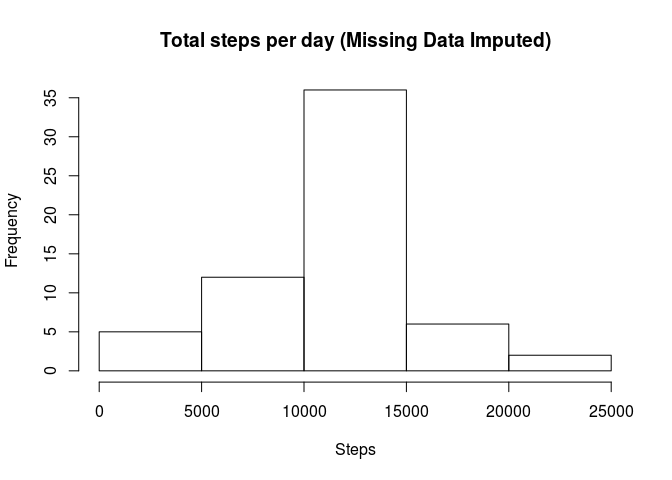
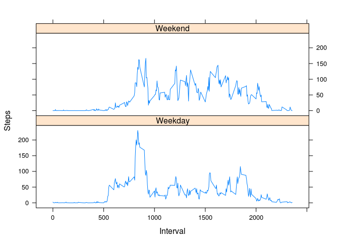

# Reproducible Research Peer Assessment 1
JT  
June 25, 2017  

## Loading and preprocessing the data


```r
setwd("~/ds/ReproducibleResearch/Week2/RepData_PeerAssessment1")
data<-read.csv(unz("activity.zip","activity.csv"),stringsAsFactors = FALSE)
d_clean<-data[!is.na(data$steps),]
```
## What is mean total number of steps taken per day?
"For this part of the assignment, you can ignore the missing values in the dataset."

```r
# Calculate the total number of steps taken per day - aggregate by day (i.e. date)
d_date<-aggregate(d_clean$steps,list(d_clean$date),sum)
names(d_date)<-c("date","steps")
# Plot
hist(d_date$steps,main="Total Steps Per Day",xlab="Steps")
```

<!-- -->

Summary measures for the average number of steps per day:

```r
m<-sprintf("%8.2f",mean(d_date$steps))
md<-sprintf("%8.2f",median(d_date$steps))
```

The mean number of steps per day is 10766.19.  
The median number of steps per day is 10765.00.  

## What is the average daily activity pattern?  


```r
# Aggregate across days by interval, then plot the time series
d_int<-aggregate(d_clean$steps,list(d_clean$interval),mean)
names(d_int)<-c("interval","steps")
with(d_int,plot(interval,steps,type="l",xlab="5-minute Interval",ylab="Steps",
                main="Average Number of Steps per Interval"))
```

<!-- -->

So, which interval contains the maximum number of steps?

```r
max_index<-which.max(d_int$steps)
max_interval<-d_int[max_index,"interval"]
max_steps<-sprintf("%5.2f",d_int[max_index,"steps"])
```

Interval 835 contains the maximum average number of steps: 206.17. I.e the 5-minute interval starting at 8:35 in the morning.

## Imputing missing values


```r
# Separate out the data that needs to be imputed
d_na<-data[is.na(data$steps),]
n_na<-dim(d_na)[1]
```

There are 2304 rows with NA in the data set.

Impute the missing step values using the average number of steps for the intervals with available data, performing some checks as well:


```r
# For each row d in d_na, set steps to average steps for the interval (stored in d_int)
d_na["steps"]<- d_int$steps[match(d_na$interval,d_int$interval)]
# Re-construct the data set by merging clean with imputed 
d_complete<-rbind(d_clean,d_na)
# Reorder
d_complete<-d_complete[order(as.numeric(row.names(d_complete))),]
```


```r
# Confirm it all looks good. First the original data
head(data,n=3)
```

```
##   steps       date interval
## 1    NA 2012-10-01        0
## 2    NA 2012-10-01        5
## 3    NA 2012-10-01       10
```

```r
# Then the aggregated-by interval data which is used to fill in the NAs
d_int[d_int$interval %in% c(0,5,10),]
```

```
##   interval     steps
## 1        0 1.7169811
## 2        5 0.3396226
## 3       10 0.1320755
```

```r
# Here is the result in the "complete" dataset
head(d_complete,n=3)
```

```
##       steps       date interval
## 1 1.7169811 2012-10-01        0
## 2 0.3396226 2012-10-01        5
## 3 0.1320755 2012-10-01       10
```

```r
# Now check one data point in original vs "complete" for un-imputed data - looks good
check<-rbind(data[800,],d_complete[800,])
row.names(check)<-c("Original","Imputed")
check
```

```
##          steps       date interval
## Original    26 2012-10-03     1835
## Imputed     26 2012-10-03     1835
```

Now the histogram and summary measures

```r
#Aggregate the "complete" dataset by day (date), then plot a histogram
d_complete_date<-aggregate(d_complete$steps,list(d_complete$date),sum)
names(d_complete_date)<-c("date","steps")
hist(d_complete_date$steps,
     main="Total steps per day (Missing Data Imputed)",xlab="Steps")
```

<!-- -->


```r
m<-sprintf("%8.2f",mean(d_complete_date$steps))
md<-sprintf("%8.2f",median(d_complete_date$steps))
```

The mean number of average steps per day is 10766.19.  
The median number of average steps per day is 10766.19.  

The means are identical in the unimputed and imputed datasets, not so the median, which is now identical to the mean.  I.e. the impact of imputing missing data seems negligible. The equality of means between non-imputed and imputed and of the mean and median in imputed is due to entire days missing and therefore the average daily total number of steps ends up being the total number of steps for those days.


```r
# d_int is used to replace a whole missing day's intervals
sum(d_int$steps)
```

```
## [1] 10766.19
```

```r
# When data was imputed the ENTIRE DAY was imputed.  Looking at the imputed dataset -
check<-aggregate(d_na$steps,list(d_na$date),sum)
names(check)<-c("Date","Steps")
check
```

```
##         Date    Steps
## 1 2012-10-01 10766.19
## 2 2012-10-08 10766.19
## 3 2012-11-01 10766.19
## 4 2012-11-04 10766.19
## 5 2012-11-09 10766.19
## 6 2012-11-10 10766.19
## 7 2012-11-14 10766.19
## 8 2012-11-30 10766.19
```


## Are there differences in activity patterns between weekdays and weekends?

It appears so... The number of steps is higher throughout the day during the weekends.  The opposite is true in the mornings.

```r
# Prepare for a quick panel plot
library(lattice)
# Define a weekday vs. weekend function and a new column in the data
wd<-function(d){ d<-weekdays(as.Date(d))
    if (d=="Saturday"|d=="Sunday"){"Weekend"}else{"Weekday"}}
d_complete["weekday"]<-sapply(d_complete$date,wd)

# Aggregate by weekday/weekend and interval.  Plot.
d_final<-aggregate(d_complete$steps,list(d_complete$weekday,d_complete$interval),mean)
names(d_final)<-c("weekday","interval","steps")
xyplot(steps~interval|weekday,type="l",layout=c(1,2),ylab="Steps",xlab="Interval",
       data=d_final)
```

<!-- -->
